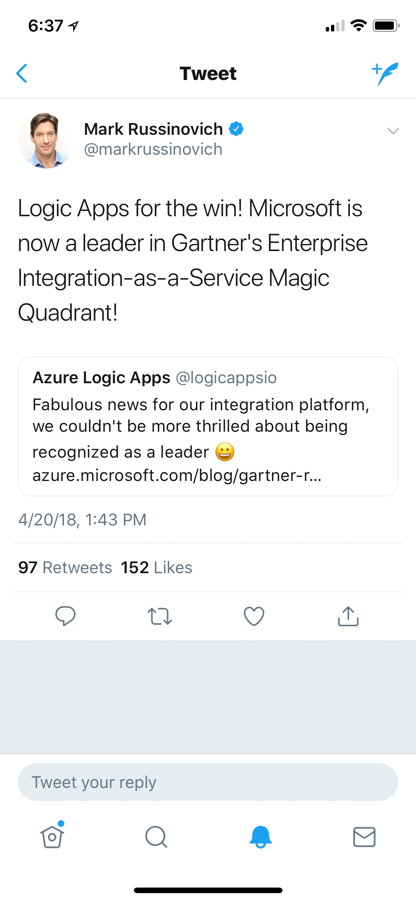

# Cognitive API Workshop

## Intro
**Name:** Chris Wiederspan  
**Role:** Microsoft Azure App Dev Specialist  
**Email:** chris.wiederspan@microsoft.com

## Topics
1. Explore and understand the [Azure Cognitive Service APIs](https://azure.microsoft.com/en-us/services/cognitive-services/)

2. Understand the [Cognitive Search Pattern](https://azure-scenarios-experience.azurewebsites.net/search-ai.html)

3. Call Cognitive APIs from [Azure Logic Apps](https://azure.microsoft.com/en-us/services/logic-apps/)

4. Call Cognitive APIs from [Azure Functions](https://azure.microsoft.com/en-us/services/functions/)

5. The JFK Files
    * [Archives](https://www.archives.gov/research/jfk/jfkbulkdownload)
    * [GitHub Repo](https://github.com/Microsoft/AzureSearch_JFK_Files)
    * [Online Demo](https://jfkfiles2.azurewebsites.net/)
    * [Online Video](https://channel9.msdn.com/Shows/AI-Show/Using-Cognitive-Search-to-Understand-the-JFK-Documents)

6. Questions